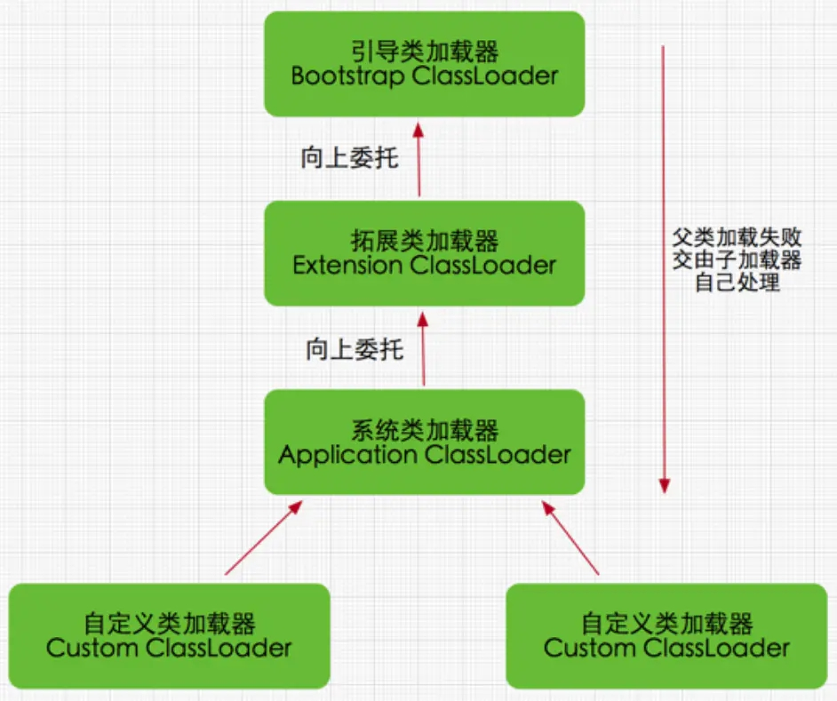

# 双亲委派模型

 

# 一、简介

站在Java虚拟机角度来看，只存在两种不同的类加载器
+ 启动类加载起，这个类加载器使用C++语言实现，是虚拟机自身的一部分
+ 其他所有类加载器，这些类加载器都由Java实现，独立存在与虚拟机外，并且全部继承自抽象类，java.lang.ClassLoader

站在Java开发人员角度来看，Java一直保持着三层类加载器、双亲委派的类加载结构

 

# 二、三层类加载器&双亲委派模型

 

## 2.1 启动类加载器(Bootstrap Class Loader)

这个类加载器负责加载存放在<JAVA_HOME>\ib目录，或者被-Xbootclasspath参数所指定的路径中存放的，而且是Java虚拟机可以识别的(按照文件名识别，如rt.jar、tools.jar，名字不符合的类库即使放在lib目录里也不会被加载)类库加载到虚拟机的内存中。  

>用户在编写自定义类加载器时，如果需要把加载请求委派给引导类加载器去处理，那直接使用null代替即可  

 

## 2.2 拓展类加载器(Extension Class Loader)

这个类加载器是在类sum.misc.Launcher$ExtCLassLoader中以Java代码的形式实现。它负责加载<JAVA_HOME>\lib\ext目录中或者被java.ext.dirs系统变量所指定的路径中所有的类库。

>开发者可以直接在程序中使用拓展类加载器来加载Class文件

 

## 2.3 应用程序类加载器(Application Class Loader)

这个类加载器由sum.misc.Launcher$AppClassLoader来实现。由于应用程序类加载器是ClassLoader类中的getSystemClassLoader()方法的返回值，所以有些场合也称它为“系统类加载器”。它负责加载用户类路径(ClassPath)上所有的类库。

>如果应用程序中没有自定义过自己的类加载器，一般情况下这个就是程序中默认的类加载器。

 

# 三、双亲委派模型

 

## 3.1 介绍
JDK9之前的Java应用都是由这三种类加载器互相配合来完成加载的，如果有必要，用户可以加入自定义的类加载器来进行拓展。  
下图展示的各种类加载器之间的层次关系被称为类加载器的“双亲委派模型”。  
  

双亲委派模型要求除了顶层的启动类加载器外，其余的类加载器都应有自己的父类加载器。
>不过，这里的类加载器之间的父子关系一般不是以继承的关系来实现的，而是通过组合关系来复用父加载器的代码。

 

## 3.2 工作过程
双亲委派模型的工作过程是：如果一个类加载器收到了类加载的请求，他首先不会自己去尝试加载这个类，而是把这个请求委派给父类加载器去完成，每一个层次的类加载器都是如此，因此所有的类加载请求最终都应该传送到最顶层的启动类加载器中，只有当父加载器反馈自己无法完成这个加载请求(它的搜索范围中没有找到所需的类)时，子加载器才会尝试自己去完成加载。

 

## 3.3 使用双亲委派模型的好处

一个显而易见的好处就是Java中的类说着它的类加载器一起具备了一种带有优先级的层次关系。  
例如类java.lang.Object，它存放在rt.jar中，无论哪一个类加载器要加载这个类，最终都是委派给处于模型最顶端的启动类加载器进行加载，因此Object类在程序的各种类加载器环境中都能保证是同一个类。

 

# 四、破坏双亲委派模型

 

## 4.1 第一次破坏
　　
发生在双亲委派模型出现之前，JDK1.2之前的“远古”时代。  
　　由于双亲委派模型是在JDK1.2之后才被引入的，但是类加载器的概念和抽象类java.lang.ClassLoader在Java第一个版本就已经存在，面对已经存在的用户自定义类加载器的代码，在引入双亲委派模型时不得不做出妥协。  
　　为了兼容这些已有代码，无法再以技术手段避免LoadClass()被子类覆盖的可能性，只能在JDK1.2之后的java.lang.ClassLoader中添加一个新的protected方法findClass()中编写代码。  
　　按loadClass()方法(双亲委派的具体逻辑就实现在这里)的逻辑，如果父类加载失败，会自动调用自己的findClass()方法来完成加载，这样既不影响用户按照自己的意愿去加载类，又可以保证新写出来的类加载器是符合双亲委派规则的。

 

## 4.2 第二次破坏

双亲委派模型第二次被破坏是由这个模型自身的缺陷导致的，双亲委派很好地解决了各个类加载器协作时基础类型的一致性问题。  
基础类型之所以被称为基础，是因为它们总是作为被用户代码继承、调用的API存在，但如果有基础类型又要调用回用户的代码，这该怎么办呢？  
为了解决这个问题，Java设计团队引入了：线程上下文类加载器(Thread Context ClassLoader)。这个类加载器可以通过java.lang.Thread类的setContextClassLoader()方法进行设置，如果创建线程时还未设置，它将会从父进程中继承一个，如果在应用程序的全局范围内都没有设置过的话，那这个类加载器默认就是应用程序类加载器。
>举例：JNDI、JDBC、JCE、JAXB、JBI等

 

## 4.3 第三次破坏

双亲委派模型第三次被破坏是由于用户对程序动态性的追求而导致的(代码热替换，模块热部署)，

 

### 4.3.1 OSGi是如何通过类加载器实现热部署的

OSGi实现模块化热部署的关键是它自定义的类加载器机制的实现，每一个程序模块(OSGi中称为Bundle)都有一个自己的类加载器，当需要更换一个Bundle时，就把Bundle连同类加载器一起换掉，以实现代码的热替换。在OSGi环境下，类加载器不再是双亲委派模型推荐的树状结构，二是进一步发展为更加复杂的网状结构，当收到类加载请求时，OSGi将按照下面的顺序进行类搜索

1. 将以java.*开头的类，委派给父类加载器加载
2. 否则，将委派列表名单内的类，委派给父类加载器加载
3. 否则，将Import列表中的类，委培给Export这个类的Bundle的类加载器加载
4. 否则，查找当前Bundle的ClassPath，使用自己的类加载器加载
5. 否则，查找类是否在自己的Fragment Bundle中，如果在，则委派给Fragment Bundle的类加载器加载
6. 否则，查找Dynamic Import列表的Bundle，委派给对应Bundle的类加载器加载
7. 否则，类查找失败

上面的查找顺序中，只有开头两点仍然符合双亲委派模型的原则，其余的类查找都是在平级的类加载器中进行的。

 

## 4.4 在很多的时候面试官会问我们如何破坏双亲委派模型和为什么要破坏它
在实际的应用中双亲委派解决了java 基础类统一加载的问题，但是却着实存在着一定的缺陷。jdk中的基础类作为用户典型的api被调用，但是也存在被api调用用户的代码的情况，典型的如SPI代码。

>SPI机制简介
>
>SPI的全名为Service Provider Interface，主要是应用于厂商自定义组件或插件中。在java.util.ServiceLoader的文档里有比较详细的介绍。简单的总结下java SPI机制的思想：我们系统里抽象的各个模块，往往有很多不同的实现方案，比如日志模块、xml解析模块、jdbc模块等方案。面向的对象的设计里，我们一般推荐模块之间基于接口编程，模块之间不对实现类进行硬编码。一旦代码里涉及具体的实现类，就违反了可拔插的原则，如果需要替换一种实现，就需要修改代码。为了实现在模块装配的时候能不在程序里动态指明，这就需要一种服务发现机制。Java SPI就是提供这样的一个机制：为某个接口寻找服务实现的机制。有点类似IOC的思想，就是将装配的控制权移到程序之外，在模块化设计中这个机制尤其重要。

所以jdk开发人员就引入了线程上下文类加载器（Thread Context ClassLoader），这类类加载器可以通过java.lang.Thread 类的setContextClassLoader方法进行设置。

其实在jdbc的使用中，我们很好的体会到它的作用，我们平时看到的mysql的加载是这个样子的：
  
在以上的代码中就实现了注册mysql驱动和获取数据库连接。
  

以上的代码是DriverManager的初始化方法loadInitialDrivers，大家可以从中看到先是获取jdbc.drivers属性，得到类的路径。然后通过系统类加载器加载。

注意driversIterator.next最终就是调用Class.forName(DriverName, false, loader)方法，也就是最开始我们在第一张图中注释掉的那一句代码。

对于自己加载不了的类怎么办，直接用线程上下类加载器加载，通过

ClassLoadercl =Thread.currentThread.getContextClassLoader;

这条语句获取本地线程然后实现上下类加载。所以这个地方Bootstrap Classloader加载器拿到了Application ClassLoader加载器应该加载的类，就打破了双亲委派模型

>参考：《深入理解Java虚拟机-第三版》
>文章：https://www.sohu.com/a/334000357_505800